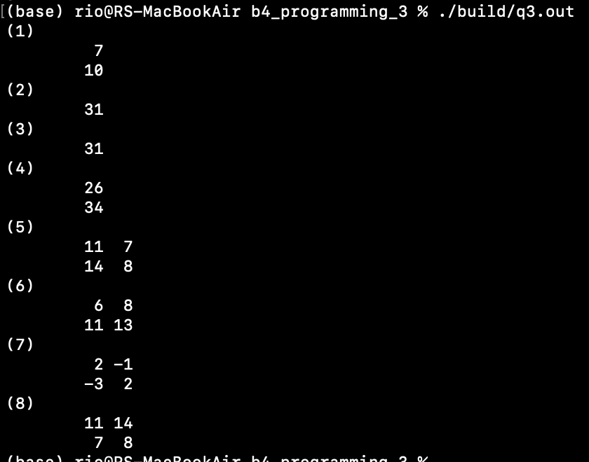

# 問3
funcs.c
## (1)function:func1  
returns: $\boldsymbol{x}+\boldsymbol{y}$  
Arg1: $\boldsymbol{x}\in\mathbb{R}^2$  
Arg2: $\boldsymbol{y}\in\mathbb{R}^2$  
```
Vector func1(Vector x, Vector y);
```
## (2)function:func2 
returns: $\boldsymbol{x}\cdot\boldsymbol{y}$  
Arg1: $\boldsymbol{x}\in\mathbb{R}^2$  
Arg2: $\boldsymbol{y}\in\mathbb{R}^2$  
```
double func2(Vector x, Vector y);
```
## (3)function:func3
returns: ${}^t\boldsymbol{x}\boldsymbol{y}$  
Arg1: $\boldsymbol{x}\in\mathbb{R}^2$  
Arg2: $\boldsymbol{y}\in\mathbb{R}^2$  
```
double func3(Vector x, Vector y);
```
## (4)function:func4
returns: $A\boldsymbol{x}$  
Arg1: $A\in M(2,2)$  
Arg2: $\boldsymbol{x}\in\mathbb{R}^2$  
```
Vector func4(Matrix A, Vector x);
```
## (5)function:func5
returns: $AB$  
Arg1: $A\in M(2,2)$  
Arg2: $B\in M(2,2)$  
```
Matrix func5(Matrix A, Matrix B);
```
## (6)function:func6
returns: $BA$  
Arg1: $B\in M(2,2)$  
Arg2: $A\in M(2,2)$  
```
Matrix func6(Matrix B, Matrix A);
```
## (7)function:func7
returns: $B^{-1}$  
Arg1: $B\in M(2,2)$  
```
Matrix func7(Matrix B);
```
## (8)function:func8
returns: ${}^t (AB)$  
Arg1: $A\in M(2,2)$  
Arg2: $B\in M(2,2)$ 
```
Matrix func8(Matrix A, Matrix B);
```


